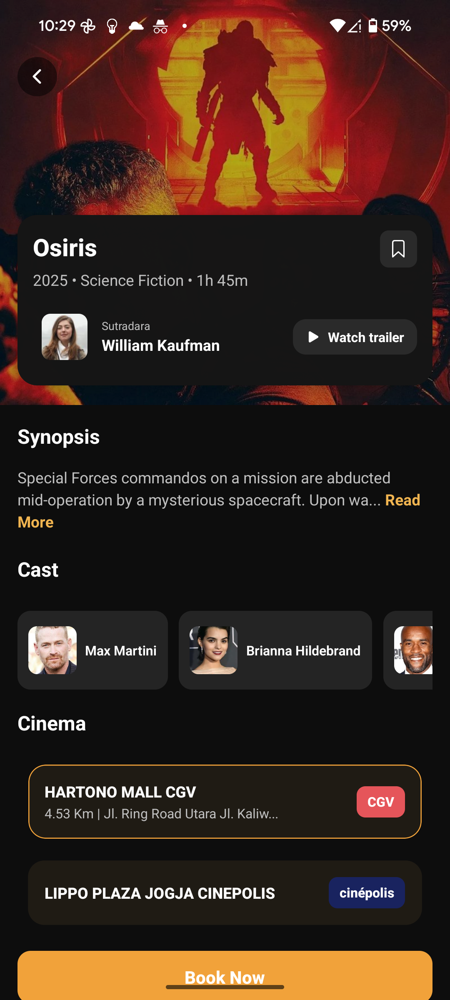
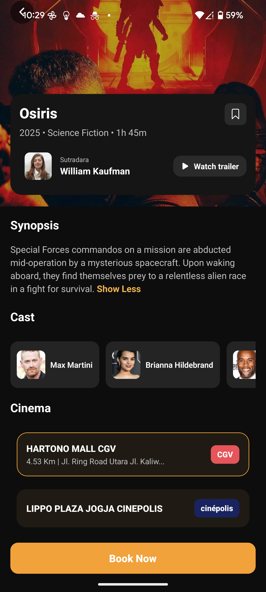

# 🎬 MovieApp

A beautifully designed **React Native + TypeScript** mobile application for browsing movies, viewing details, checking cast information, and booking cinema tickets.  
Built with **Expo** for fast development and smooth cross-platform performance.

---

## ✨ Features

- **🎥 Movie Listings** – Browse through popular and trending movies.
- **📄 Movie Details** – View synopsis, director, cast, and trailer links.
- **👥 Cast Display** – Stylish cast section with profile pictures and names in horizontal scroll.
- **📍 Cinema Listings** – Nearby cinema cards with distance and address.
- **🖱 Read More / Read Less** – Toggle synopsis text dynamically.
- **🎨 Modern UI** – Dark theme with soft accent colors, transparent cards, and smooth scrolling.

---

## Screenshots


  |  |
 


---

## Tech Stack

- **React Native** (via [Expo](https://expo.dev/))
- **TypeScript**
- **React Navigation**
- **TMDb API** (or your movie API of choice)
- **Styled Components / Custom Styles**

---

## Folder Structure

```plaintext
MovieApp/
├── assets/              # Images, icons, fonts
├── src/
│   ├── components/      # Reusable UI components
│   ├── screens/         # App screens (Home, Details, etc.)
│   ├── navigation/      # Navigation configuration
│   ├── hooks/           # Custom hooks
│   ├── services/        # API calls & helpers
│   ├── styles/          # Theme & styles
│   └── types/           # TypeScript type definitions
├── App.tsx              # Entry point
├── package.json
├── tsconfig.json
└── README.md
```
## Installation & SetUp

**1. Clone the repository**
git clone  https://github.com/parasmalhotra522/MovieApplication.git
cd movieapp

**2. Install dependencies**
npm install
# or
yarn install

**3. Start Expo Server**
npx expo start

**4. Run on device**
Physical device: Scan the QR code in the Expo Go app

**5. Environment Variables**
Create an .env file in the root directory:
EXPO_PUBLIC_TMDB_API_KEY=your_api_key_here

Get your API key from TMDb.

